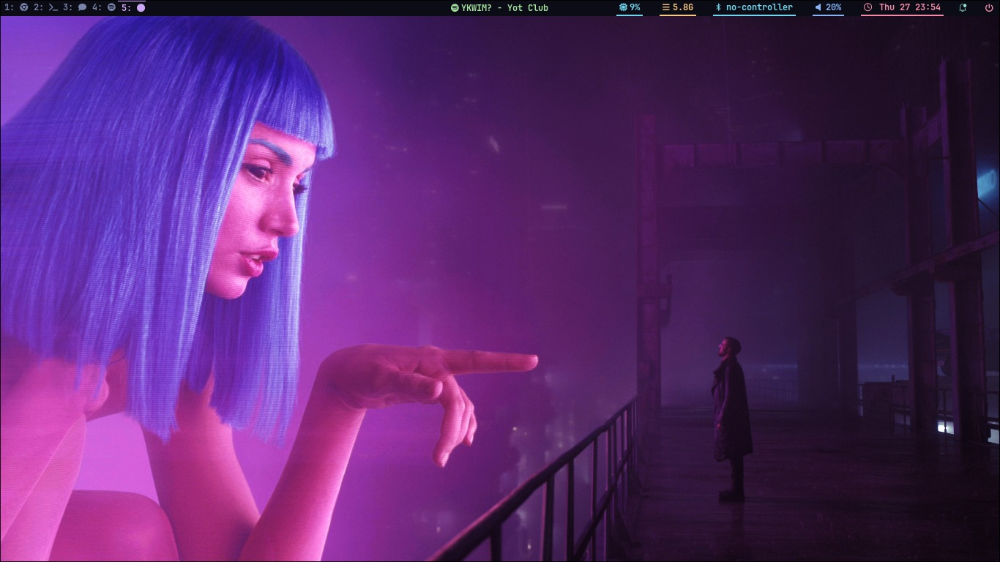
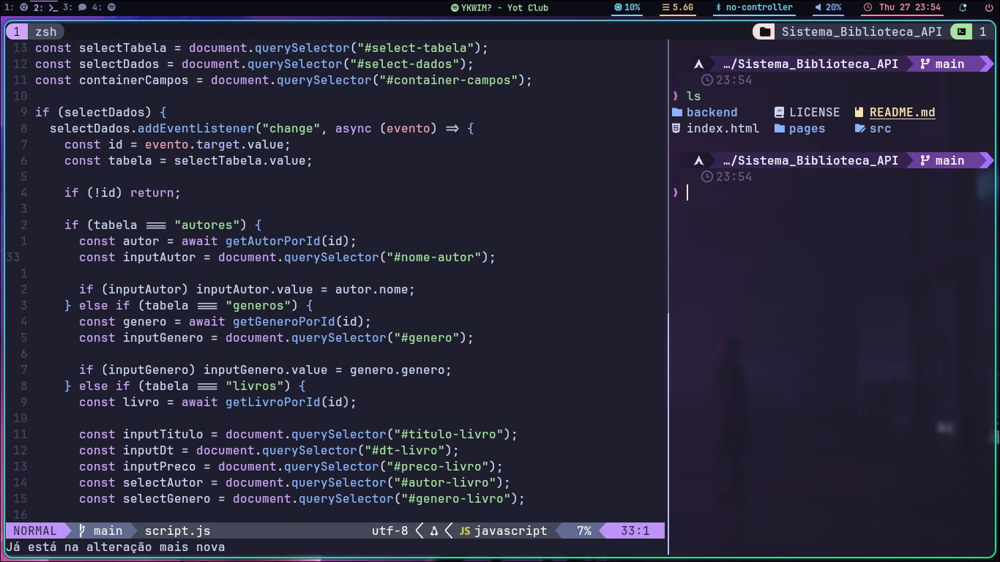
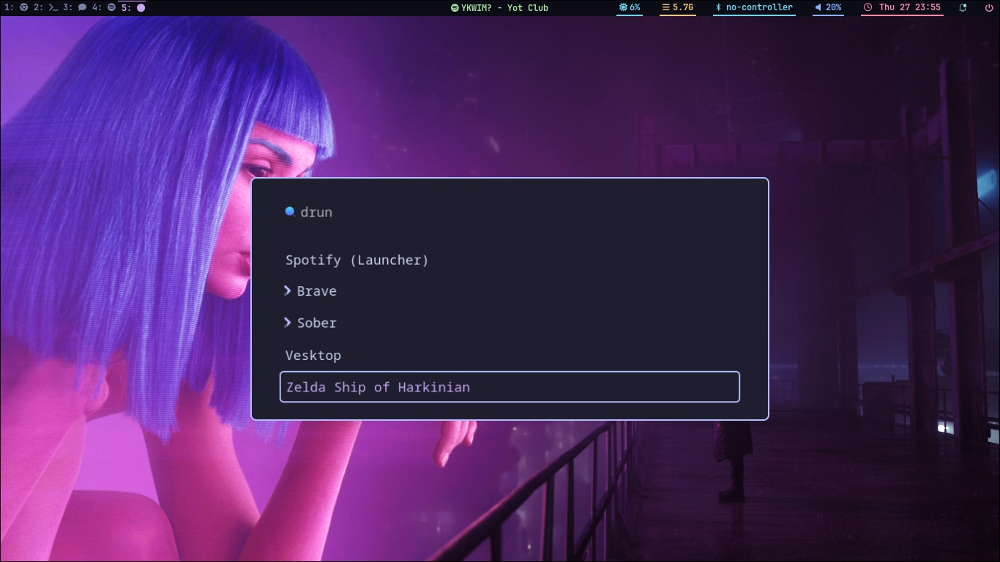

# Meus Dotfiles

Minhas configurações pessoais de ambiente gerenciadas de forma modular com **GNU Stow**.



---

## Detalhes do Ambiente

| Componente | Software |
| :--- | :--- |
| **OS** | Arch Linux / Linux |
| **WM / Compositor** | [Hyprland](https://hyprland.org/) |
| **Barra de Status** | [Waybar](https://github.com/Alexays/Waybar) |
| **Lançador de Apps** | [Wofi](https://hg.sr.ht/~scoopta/wofi) |
| **Terminal** | [Kitty](https://sw.kovidgoyal.net/kitty/) |
| **Editor** | [Neovim](https://neovim.io/) |
| **Shell & Prompt** | [Zsh](https://www.zsh.org/) + [Starship](https://starship.rs/) |
| **Notificações** | [SwayNotificationCenter](https://github.com/ErikReider/SwayNotificationCenter) |
| **Aparência / GTK** | `nwg-look`, `gtk-3.0`, `gtk-4.0`, `xsettingsd` |
| **Wallpapers** | Pasta modular `backgrounds` |

---

## Screenshots

<p align="center">
  
  
</p>

---

## Instalação

### 1. Pré-requisitos

Instale as ferramentas base e os utilitários de terminal usados nas configurações:

```bash
sudo pacman -S stow git zsh starship fzf zoxide eza bat ripgrep fd
```

Defina o Zsh como sua shell padrão:

```bash
chsh -s $(which zsh)
```

### 2. Clonando o Repositório

Clone este repositório diretamente no seu `$HOME`:

```bash
git clone https://github.com/gabtapia/dotfiles.git ~/dotfiles
cd ~/dotfiles
```

### 3. Aplicando os Dotfiles com Stow

Antes de rodar o Stow pela primeira vez, remova quaisquer arquivos padrões criados pelo sistema na sua home para evitar conflitos de symlink:

```bash
rm -f ~/.zshrc ~/.zshenv ~/.bashrc ~/.bash_profile
```

Para linkar todos os pacotes de uma vez:

```bash
stow -v *
```

Ou aplique apenas pacotes específicos:

```bash
stow -v hypr waybar kitty nvim zsh backgrounds
```

> **Nota:** As configurações do Zsh seguem a especificação XDG (`~/.config/zsh`). O arquivo `~/.zshenv` é linkado na raiz da Home para direcionar o ZDOTDIR automaticamente, e os diretórios de cache (`~/.cache/zsh`) e histórico (`~/.local/state/zsh`) são criados automaticamente na primeira inicialização da shell.

---

## Créditos & Inspirações

* As configurações do **Kitty**, **Hyprlock** e do **Wofi** são inspiradas e baseadas nos dotfiles do [typecraft](https://github.com/typecraft-dev/dotfiles) (canal [typecraft](https://www.youtube.com/@typecraft_dev)).
* Estrutura e organização modular do **Zsh** baseadas no guia do [The Rad Lectures](https://youtu.be/1jE7rCvByHg).
